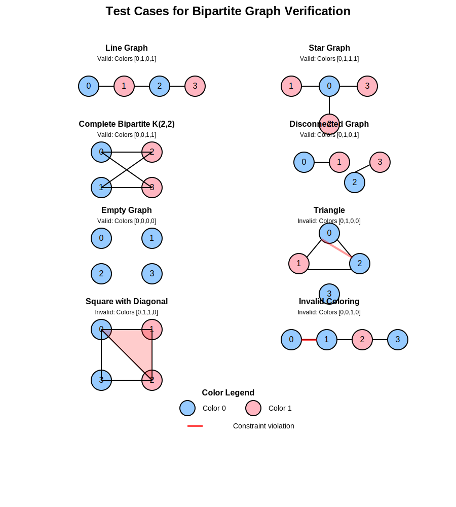

# Homework 1

1. Create an arithmetic circuit that takes signals $x_1, x_2, …, x_n$ and is satisfied if at least one signal is 0.

   - Product all signals and constrain the product to 0. $$x_1 \cdot x_2...\cdot x_n=0$$

```circom
pragma circom 2.0.0;

template AtLeastOneZero(n) {
    signal input x[n];
    signal product[n+1];

    product[0] <== 1;
    for (var i = 0; i < n; i++) {
        product[i+1] <== product[i] * x[i];
    }

    product[n] === 0;
}

component main = AtLeastOneZero(3);
```

2. Create an arithmetic circuit that takes signals $x_1, x_2, …, x_n$ and is satsified if all signals are 1.

   - Constrain inputs to be binary and invert. Then follow the previous questions logic to find a single zero.

```circom
template AtLeastOneOneBinary(n) {
    signal input x[n];

    for (var i = 0; i < n; i++) {
        x[i] * (x[i] - 1) === 0;  //Constrain the inputs to be binary
    }

    //Invert the binaries
    signal not_x[n];
    for (var i = 0; i < n; i++) {
        not_x[i] <== 1 - x[i];
    }


    //Find product
    signal product[n+1];
    product[0] <== 1;
    for (var i = 0; i < n; i++) {
        product[i+1] <== product[i] * not_x[i];
    }

    //Constrain product to 0
    product[n] === 0;

    signal output out;
    out <== 1 - product[n];
}

component main = AtLeastOneOneBinary(3);

```

3. A bipartite graph is a graph that can be colored with two colors such that no two neighboring nodes share the same color. Devise an arithmetic circuit scheme to show you have a valid witness of a 2-coloring of a graph. Hint: the scheme in this tutorial needs to be adjusted before it will work with a 2-coloring.

```circom
pragma circom 2.0.0;

template BipartiteVerifier(n) {

    // Input: adjacency matrix (0 if no edge, 1 if edge exists)
    signal input adjacencyMatrix[n][n];

    // Input: color assignment for each node (0 or 1)
    signal input colors[n];

    // Pre-declare all signals needed for edge checking
    signal xor[n][n];
    signal invalid[n][n];

    // Check that each color is binary (0 or 1)
    for (var i = 0; i < n; i++) {
        // Constraint: colors[i] * (colors[i] - 1) = 0 ensures colors[i] is either 0 or 1
        colors[i] * (colors[i] - 1) === 0;
    }

    // Check that adjacent nodes have different colors
    for (var i = 0; i < n; i++) {
        for (var j = i+1; j < n; j++) {  // Process each edge once (undirected graph)
            // For each edge that exists

            // For binary inputs, XOR is the same as addition mod 2
            // colors[i] + colors[j] == 1 when they have different colors
            xor[i][j] <== colors[i] + colors[j] - 2 * colors[i] * colors[j];

            // If there's an edge (adjacencyMatrix = 1), then colors must be different (xor = 1)
            // So for valid edges, adjacencyMatrix * (1-xor) must be 0
            invalid[i][j] <== adjacencyMatrix[i][j] * (1 - xor[i][j]);

            // This must be zero for a valid coloring
            invalid[i][j] === 0;
        }
    }

    // If all constraints are satisfied, then the graph has a valid 2-coloring
}

// Example usage for a 4-node graph
component main {public [adjacencyMatrix]} = BipartiteVerifier(4);

```



4. Create an arithmetic circuit that constrains k to be the maximum of $x, y$, or $z$. That is, $k$ should be equal to $x$ if $x$ is the maximum value, and same for $y$ and $z$.

```circom   
pragma circom 2.0.0;

template MaxOfXYOrZ() {
    // Input signals
    signal input x;
    signal input y;
    signal input z;

    // Output signal
    signal output k;

    // Intermediate signals for comparisons
    signal x_gr_y; 
    signal x_gr_z; 
    signal y_gr_z; 
    signal y_gr_x; 
    signal z_gr_x; 
    signal z_gr_y; 


    x_gr_y <-- x > y ? 1 :0;
    x_gr_z <-- x > z ? 1 :0;
    y_gr_x <-- y > x ? 1 :0;
    y_gr_z <-- y > z ? 1 :0;
    z_gr_x <-- z > x ? 1 :0;
    z_gr_y <-- z > y ? 1 :0;

    signal x_max;
    signal y_max;
    signal z_max;
    x_max <-- x_gr_z * x_gr_y * x;
    y_max <-- y_gr_z * y_gr_x * y;
    z_max <-- z_gr_x * z_gr_y * z;
    
    k <== x_max + y_max + z_max;

}

component main {public [x, y, z]} = MaxOfXYOrZ();
```

5. Create an arithmetic circuit that takes signals $x_1, x_2, …, x_n$, constrains them to be binary, and outputs 1 if at least one of the signals is 1. Hint: this is tricker than it looks. Consider combining what you learned in the first two problems and using the NOT gate.

6. Create an arithmetic circuit to determine if a signal $v$ is a power of two (1, 2, 4, 8, etc). Hint: create an arithmetic circuit that constrains another set of signals to encode the binary representation of $v$, then place additional restrictions on those signals.

7. Create an arithmetic circuit that models the [Subset sum problem](https://en.wikipedia.org/wiki/Subset_sum_problem). Given a set of integers (assume they are all non-negative), determine if there is a subset that sums to a given value $k$. For example, given the set ${3,5,17,21}$ and $k=22$, there is a subset ${5,17}$ that sums to $22$. Of course, a subset sum problem does not necessarily have a solution.

> Hint: Use a “switch” that is 0 or 1 if a number is part of the subset or not.

8. The covering set problem starts with a set $S={1,2,...,10}$ and several well-defined subsets of $S$, for example: ${1,2,3}$, ${3,5,7,9}$, ${8,10}$, ${5,6,7,8}$, ${2,4,6,8}$, and asks if we can take at most $k$ subsets of $\mathbf{S}$ such that their union is $\mathbf{S}$. In the example problem above, the answer for $k=4$ is true because we can use ${1,2,3}$, ${3,5,7,9}$, ${8,10}$, ${2,4,6,8}$. Note that for each problems, the subsets we can work with are determined at the beginning. We cannot construct the subsets ourselves. If we had been given the subsets ${1,2,3}$, ${4,5}$, ${7,8,9,10}$ then there would be no solution because the number $6$ is not in the subsets. On the other hand, if we had been given $\mathbf{S}={1,2,3,4,5}$ and the subsets ${1},{1,2},{3,4},{1,4,5}$ and asked can it be covered with $k=2$ subsets, then there would be no solution. However, if $k=3$ then a valid solution would be ${1,2},{3,4},{1,4,5}$. Our goal is to prove for a given set $\mathbf{S}$ and a defined list of subsets of $\mathbf{S}$, if we can pick a set of subsets such that their union is $\mathbf{S}$. Specifically, the question is if we can do it with $k$ or fewer subsets. We wish to prove we know which $k$ (or fewer) subsets to use by encoding the problem as an arithmetic circuit.
